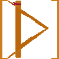
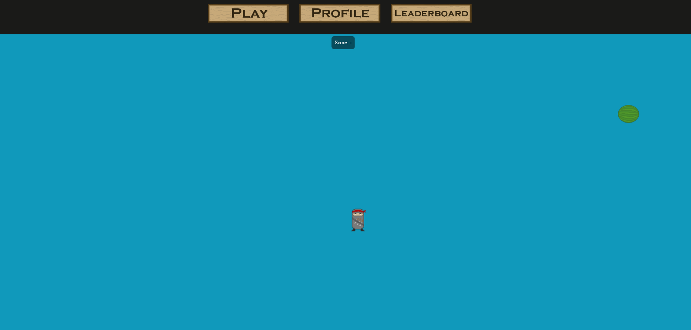

  

<h1 align="center"> Dodge Ninja - a back to basics web game for improving your reflexes </h1>

# Alpha Version 0.0.1

## Dodge Ninja

Dodge oncoming fruits in order to train your reflexs to be as sharp as a ***ninja's***!

## Gameplay loop

Dodge oncoming fruits, with each fruit you dodge the higher your score goes.

  

With a high enough score you might even make it to the top of the *Leaderboards*!

## Stack & Running the program
This is the frontend part of our project.

It is built with **Vite + React** using **TypeScript** and the **PIXI** framework to implement gameplay logic.

## FAQ

Q: Has anyone ever asked you anything about this project?
A: No.